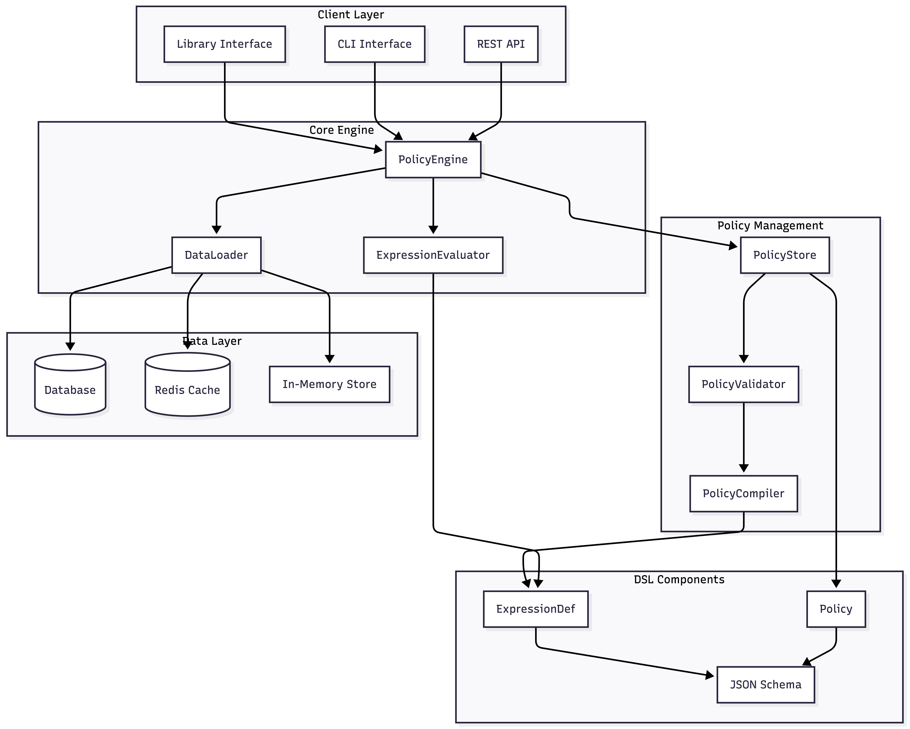

# 전체 아키텍쳐 개요

* 다이어그램은 Mermaid.js를 이용해 작성했습니다.

# 권한 평가 흐름

## 주요 특징
1. DENY 정책 우선평가
2. 명시적 허용이 없는 경우 권한을 허용하지 않음 (Fail-Safe)

## 시스템 동작 흐름
1. 요청 진입 단계 (Client -> PolicyEngine)
2. 정책 검색 및 로드 단계 (PolicyEngine <-> PolicyStore)
3. 데이터 보강 단계 (PolicyEngine -> DataLoader -> Data Layer) 
4. 논리 평가 단계 (PolicyEngine -> ExpressionEvaluator -> DSL Components (ExpressionDef))
5. 최종 결정 및 반환 단계 (PolicyEngine -> Client Layer)

### 시스템 동작 흐름 예시
1. User A가 Document X에 대해 CAN_EDIT 요청
2. PolicyStore에서 Document Entity, CAN_EDIT 권한에 해당하는 모든 정책 로드
3. 로드된 정책을 DENY List와 ALLOW List로 분류
4. 사용자의 권한을 수집하기 위해 DataLoader가 Repository 조회
5. 거부 조건 검사: DENY 정책 중 하나라도 TRUE면 즉시 거부 반환
6. 허용 조건 검사: ALLOW 정책 중 하나라도 TRUE면 허용 반환 (문서 생성자 / 프로젝트 편집 권한 이상 / 팀 관리자)
7. 최종 결과 반환, Default Deny

# 표현식 평가 흐름

## CASE AND
1. 각 하위 표현식을 건별로 평가
2. 하나라도 FALSE면 즉시 FALSE 반환
3. NULL이 섞여있고 FALSE가 없으면 NULL 반환
4. 모두 TRUE면 TRUE 반환

## CASE OR
1. 각 하위 표현식을 건별로 평가
2. 하나라도 TRUE면 즉시 TRUE 반환
3. NULL이 섞여있고 TRUE가 없으면 NULL 반환
4. 모두 FALSE면 FALSE 반환

## CASE NOT
1. 내부 표현식 평가
2. 내부가 NULL이면 NULL 반환
3. 내부가 TRUE면 FALSE, 내부가 FALSE면 TRUE 반환

## CASE BINARY
1. 좌측 필드와 우측 필드의 값을 데이터에서 조회
2. 둘 중 하나라도 NULL이면 NULL 반환
3. 실제 값 비교 수행 (==, !=, >, < 등)
4. 비교 결과에 따라 TRUE 또는 FALSE 반환

# 주요 설계 결정 및 트레이드 오프

## 권한 제어 시스템 접근 방식 비교

### 표현식 기반 (Expression-based) / 대표 시스템: Figma DSL
- 표현 방법: {"and": [{"field": "doc.id", "op": "==", "value": "..."}]} 와 같이 JSON 트리 구조로 논리를 정의
- 장점 
  - JSON 형태로 데이터베이스에 저장하거나 API로 주고받기 매우 쉬움. 
  - 구조가 정형화되어 있어 타입 안정성(Type Safety) 확보가 용이함. 
  - 본 시스템의 Team → Project → Document와 같은 계층적 JOIN 관계를 직관적으로 표현함.
- 단점 
  - 미리 정의된 연산자 외에 복잡한 비즈니스 로직(예: 외부 함수 호출 등)을 담기 어려움. 
  - 표현식이 중첩될수록 JSON의 가독성이 급격히 떨어짐.
### 규칙 기반 (Rule-based) / 대표 시스템: OPA (Open Policy Agent)
- 표현 방법: allow { input.user.role == "admin"; input.doc.public == true } 와 같이 선언적 스크립트로 정의
- 장점 
  - 단순 비교를 넘어 리스트 조작, 데이터 가공 등 매우 강력한 표현력을 가짐. 
  - 정책을 코드처럼 관리(Policy as Code)하고 테스트하기 좋음.
- 단점 
  - Rego와 같은 별도의 정책 언어를 학습해야 하는 비용이 발생함. 
  - 6개의 엔티티 테이블을 모두 참조하며 복잡한 JOIN을 수행할 때 스크립트가 매우 비대해짐.
### 관계형 튜플 (Relational Tuple) / 대표 시스템: Google Zanzibar
- 표현 방법: doc:1#viewer@user:A (사용자 A는 문서 1의 뷰어다) 와 같은 단순 관계 기록(Tuple)
- 장점 
  - Team → Project → Document로 이어지는 객체 간의 관계를 그래프 형태로 연결하여 매우 빠르게 탐색함. 
  - 전 세계 규모의 대용량 트래픽에서도 성능 확장성이 매우 뛰어남.
- 단점 
  - 시스템 자체를 구축하고 운영하는 엔지니어링 복잡도가 매우 높음. 
  - 단순 관계 외에 '문서가 삭제되지 않았을 것'과 같은 동적인 상태(State) 기반 필터링 처리가 번거로움.
### 리소스 블록 (Resource Block) / 대표 시스템: Oso Polar
- 표현 방법: resource Document { roles = ["viewer", "editor"]; allow(user, "edit") if user.role == "editor"; } 처럼 엔티티 중심 정의
- 장점 
  - viewer → editor → admin으로 이어지는 역할 상속(Role Inheritance) 모델을 가장 깔끔하게 코드로 구현함. 
  - 애플리케이션 내의 객체 지향 모델과 정책 간의 매핑이 자연스러움.
- 단점 
  - 관리해야 할 엔티티(User, Team, Project 등 6개 이상)가 늘어날수록 각 리소스 블록 간의 관계 정의가 복잡해짐. 
  - 중앙 집중식 관리보다는 개별 리소스 정의에 치중되는 경향이 있음.

## 선택한 접근 방식: 표현식 기반 (Expression-based)

### 근거 및 장점
- 크로스 플랫폼 호환성: JSON 직렬화를 통해 다양한 언어/플랫폼에서 동일한 정책 사용 가능
- 타입 안전성: Java 21의 Sealed Classes와 Records를 활용하여 6개 엔티티 타입 안전성 확보 가능
- 점진적 복잡성: 단순한 `document.creatorId = user.id`부터 복잡한 멀티테이블 JOIN까지 점차 확장
- 디버깅 용이성: 각 테이블별 로딩 상태와 표현식 평가 결과를 개별 추적 가능
- 친숙도: Figma에서 제공하는 기능과 과제에서 요구하는 기능사항이 가장 유사하여 학습 곡선이 낮음

### 단점
- 간결하게 표현하기만 하려면 다른 대안이 더 나을 수 있음. ex: Zanzibar 관계 / document#view@user:alice#team_admin
- 데이터가 커질수록 JSON 파싱 및 평가 성능 최적화 필요, 가독성에서도 불리함. 
  - ex: Oso Polar / ```allow(user, "edit", doc) if user.role == "admin" or user.id == doc.creatorId;```
  - ex: Figma DSL / ```{
  "type": "OR",
  "children": [
    {
      "type": "BINARY",
      "leftField": "user.role",
      "operator": "EQUALS",
      "rightValue": "admin"
    },
    {
      "type": "BINARY",
      "leftField": "user.id",
      "operator": "EQUALS",
      "rightField": "document.creatorId"
    }
  ]
}```